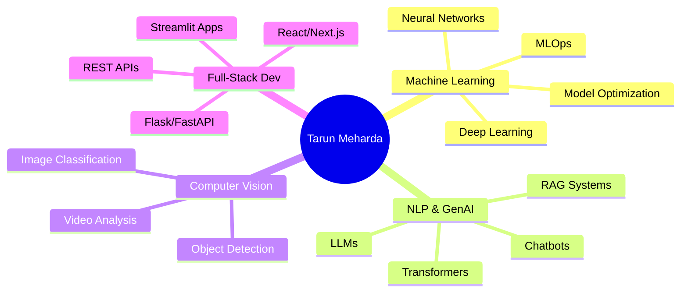

<div align="center">

# 👋 Hello, I'm Tarun Meharda

### 🚀 AI & Machine Learning Engineer | Data Scientist | AI/ML

<p>
  <a href="https://tarun-meharda-portfolio.netlify.app/" target="_blank">
    
  </a>
  <a href="https://www.linkedin.com/in/tarun-meharda-62878a34a/" target="_blank">
    
  </a>
  <a href="mailto:tarunmehrda@gmail.com">
    
  </a>
  <a href="https://github.com/tarunmehrda" target="_blank">
    
  </a>
</p>


</div>

---

## 🎯 About Me

```python
class TarunMeharda:
    def __init__(self):
        self.role = "AI & Machine Learning Engineer"
        self.location = "Pilani, Rajasthan, India"
        self.education = "B.Tech in Computer Science"
        self.passions = ["Deep Learning", "Generative AI", "LLMs", "AI Agents"]
        self.current_focus = ["Transformers", "RAG Systems", "MLOps"]
        
    def say_hi(self):
        print("Let's build something amazing together! 🚀")

me = TarunMeharda()
me.say_hi()
```

💡 **Mission:** Transforming complex data into intelligent, real-world solutions  
🧠 **Specialty:** End-to-end ML pipelines from research to production deployment  
🔭 **Currently Exploring:** Large Language Models, AI Agents, and Neural Architecture Search

---

## 🛠️ Tech Arsenal

<details open>
<summary><b>🧠 Core Languages</b></summary>
<br>


</details>

<details open>
<summary><b>🤖 AI & Machine Learning</b></summary>
<br>


</details>

<details open>
<summary><b>🧬 NLP & Generative AI</b></summary>
<br>


</details>

<details open>
<summary><b>🌐 Web Development & Deployment</b></summary>
<br>


</details>

<details open>
<summary><b>💾 Databases & Cloud</b></summary>
<br>


</details>

<details open>
<summary><b>⚙️ Tools & DevOps</b></summary>
<br>


</details>

---

## 🌟 Featured Projects

<div align="center">

| 🚀 Project | 📝 Description | 💻 Tech Stack | 🔗 Link |
|------------|----------------|---------------|---------|
| **📈 Real-Time Stock & Crypto Predictor** | LSTM-based minute-level price prediction system with live data streaming | `Python` `TensorFlow` `LSTM` `Streamlit` | [View →](https://github.com/tarunmehrda/Real-Time-Stock-Crypto-Minute-Level-Price-Prediction) |
| **🤖 CoderBuddy AI Assistant** | Intelligent coding companion powered by OpenAI for real-time code generation | `Python` `OpenAI API` `FastAPI` `React` | [View →](https://github.com/tarunmehrda/CoderBuddy) |
| **🏥 Healthcare Premium Predictor** | ML model predicting insurance premiums with 92% accuracy | `Flask` `Scikit-learn` `XGBoost` `Pandas` | [View →](https://github.com/tarunmehrda/Healthcare-Premium-Prediction) |

</div>

---

## 📊 GitHub Analytics

<div align="center">
  


</div>

---

## 🏆 Achievements & Highlights

<div align="center">

```diff
+ 🧩 Built 15+ end-to-end ML pipelines for NLP & Computer Vision projects
+ 🤝 Active contributor to open-source AI tools and libraries
+ ⚙️ Developed production-ready Streamlit dashboards with real-time insights
+ 💬 Participated in 10+ AI/ML hackathons and coding competitions
+ 📚 Published technical articles on Medium and Dev.to
+ 🎯 Achieved 95%+ accuracy on multiple predictive modeling projects
```

</div>

---

## 💼 What I Do Best

<div align="center">



</div>

---

## 📫 Let's Connect!

<div align="center">

### 💬 Open for collaboration on AI/ML projects, research, and innovative ideas!

<p>
  <a href="https://tarun-meharda-portfolio.netlify.app/" target="_blank">
    
  </a>
  <a href="https://www.linkedin.com/in/tarun-meharda-62878a34a/" target="_blank">
    
  </a>
  <a href="mailto:tarunmehrda@gmail.com">
    
  </a>
</p>

<br>


---

<p align="center">
  
</p>

**⭐️ "Transforming Data into Intelligent Decisions"**

*Built with ❤️ and lots of ☕*

</div>
