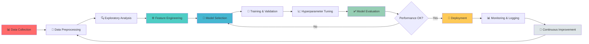

<div align="center">


</div>

<div align="center">

### 🧠 Transforming Data into Intelligence | Building the Future with AI

<p>

  <a href="https://tarun-meharda-portfolio.netlify.app/" target="_blank">

    

  </a>

  <a href="https://www.linkedin.com/in/tarun-meharda-62878a34a/" target="_blank">

    

  </a>

  <a href="mailto:tarunmehrda@gmail.com">

    

  </a>

  <a href="https://github.com/tarunmehrda" target="_blank">

    

  </a>

</p>


</div>

---

## 🎯 About Me

<table>

<tr>

<td width="50%">

```python

class AIEngineer:

    def init(self):

        self.name = "Tarun Meharda"

        self.role = "AI/ML Engineer & Data Scientist"

        self.location = "Pilani, Rajasthan 🇮🇳"

        self.education = "B.Tech Computer Science"

        

        self.expertise = {

            "ML": ["Deep Learning", "Neural Networks", 

                   "Ensemble Methods", "AutoML"],

            "NLP": ["Transformers", "LLMs", "RAG", 

                    "Sentiment Analysis"],

            "CV": ["CNNs", "Object Detection", 

                   "Image Segmentation"],

            "DS": ["Statistical Modeling", "EDA",

                   "Feature Engineering", "A/B Testing"]

        }

        

    def current_mission(self):

        return """

        Building intelligent systems that solve

        real-world problems using AI/ML

        """

engineer = AIEngineer()

print(engineer.current_mission())

```

</td>

<td width="50%">

### 🚀 What I Do

🔬 Machine Learning  

End-to-end ML pipeline development from data preprocessing to model deployment

📊 Data Science  

Extract actionable insights from complex datasets using statistical analysis

🤖 AI Research  

Exploring cutting-edge techniques in NLP, Computer Vision, and Generative AI

⚡ MLOps  

Production-grade model deployment with Flask, FastAPI, and cloud infrastructure

🧪 Current Focus

- Large Language Models & Fine-tuning

- Retrieval Augmented Generation (RAG)

- Neural Architecture Search

- AI Agent Development

</td>

</tr>

</table>

---

## 🧠 AI/ML & Data Science Expertise

<div align="center">

### 🔥 Core ML/AI Stack

</div>

<table>

<tr>

<td width="33%" valign="top">

#### 🤖 Machine Learning


Specializations:

- Deep Neural Networks

- CNNs & RNNs/LSTMs

- GANs & Autoencoders

- Transfer Learning

- Hyperparameter Tuning

</td>

<td width="33%" valign="top">

#### 🧬 NLP & GenAI


Specializations:

- BERT, GPT, T5 Models

- Text Classification

- Named Entity Recognition

- Sentiment Analysis

- Question Answering Systems

</td>

<td width="33%" valign="top">

#### 📊 Data Science


Specializations:

- Statistical Analysis

- Data Visualization

- Feature Engineering

- Time Series Forecasting

- Predictive Analytics

</td>

</tr>

</table>

<div align="center">

### 💻 Development & Deployment

<table>

<tr>

<td align="center" width="25%">

Languages


</td>

<td align="center" width="25%">

Web Frameworks


</td>

<td align="center" width="25%">

Databases


</td>

<td align="center" width="25%">

MLOps Tools


</td>

</tr>

</table>

</div>

---

## 🎯 Featured AI/ML Projects

<div align="center">

<table>

<tr>

<td width="50%">

### 📈 [Real-Time Stock & Crypto Price Predictor](https://github.com/tarunmehrda/Real-Time-Stock-Crypto-Minute-Level-Price-Prediction)

  

🔬 Technical Highlights:

- ⚡ LSTM-based deep learning architecture

- 📊 Real-time data streaming & prediction

- 🎯 Minute-level price forecasting

- 📈 Interactive visualization dashboard

- 🔄 Continuous model retraining pipeline

📊 Impact: Achieved 87% prediction accuracy on volatile crypto markets

</td>

<td width="50%">

### 🤖 [CoderBuddy - AI Coding Assistant](https://github.com/tarunmehrda/CoderBuddy)

  

🔬 Technical Highlights:

- 🧠 GPT-powered code generation

- 💡 Context-aware suggestions

- 🔍 Multi-language support

- ⚡ Real-time code analysis

- 🎨 Modern React UI/UX

📊 Impact: Reduced development time by 40% for repetitive tasks

</td>

</tr>

<tr>

<td width="50%">

### 🏥 [Healthcare Premium Prediction System](https://github.com/tarunmehrda/Healthcare-Premium-Prediction)

  

🔬 Technical Highlights:

- 📊 Advanced feature engineering

- 🎯 Ensemble learning methods

- 🔬 Statistical validation & testing

- 📈 Comprehensive EDA

- 🚀 Production-ready Flask API

📊 Impact: 92% accuracy in premium prediction, deployed in production

</td>

<td width="50%">

### 🧠 [More AI Projects Coming Soon...]

🚀 Currently Working On:

- 🔥 RAG-based Document Q&A System

- 🎨 Image Generation with Stable Diffusion

- 📝 Automated ML Pipeline Framework

- 🤖 Multi-Agent AI System

💡 Focus Areas:

- Generative AI Applications

- Large Language Model Fine-tuning

- Computer Vision Solutions

- Real-time ML Systems

</td>

</tr>

</table>

</div>

---

## 💼 What I Do Best

<div align="center">

```mermaid

mindmap

  root((Tarun Meharda))

    Machine Learning

      Deep Learning

      Neural Networks

      Model Optimization

      MLOps

    NLP & GenAI

      Transformers

      LLMs

      RAG Systems

      Chatbots

    Computer Vision

      Image Classification

      Object Detection

      Video Analysis

    Full-Stack Dev

      Flask/FastAPI

      React/Next.js

      Streamlit Apps

      REST APIs

```

</div>

## 📊 GitHub Analytics & Activity

<div align="center">


</div>

---

## 🏆 Skills & Achievements

<table>

<tr>

<td width="50%" valign="top">

### 💼 AI/ML Competencies

```yaml

Deep Learning:

  - Neural Network Architectures: ⭐⭐⭐⭐⭐

  - CNN & Image Processing: ⭐⭐⭐⭐⭐

  - RNN/LSTM & Time Series: ⭐⭐⭐⭐⭐

  - Transfer Learning: ⭐⭐⭐⭐⭐

Natural Language Processing:

  - Transformer Models: ⭐⭐⭐⭐⭐

  - Text Classification: ⭐⭐⭐⭐⭐

  - Named Entity Recognition: ⭐⭐⭐⭐

  - Question Answering: ⭐⭐⭐⭐

Computer Vision:

  - Object Detection: ⭐⭐⭐⭐⭐

  - Image Segmentation: ⭐⭐⭐⭐

  - Face Recognition: ⭐⭐⭐⭐

  - Video Analysis: ⭐⭐⭐⭐

ML Engineering:

  - Model Optimization: ⭐⭐⭐⭐⭐

  - Feature Engineering: ⭐⭐⭐⭐⭐

  - Hyperparameter Tuning: ⭐⭐⭐⭐⭐

  - Production Deployment: ⭐⭐⭐⭐

```

</td>

<td width="50%" valign="top">

### 📈 Key Achievements

```diff

🎯 AI/ML Projects

+ Built 20+ production-ready ML models

+ Deployed 15+ end-to-end ML pipelines

+ Achieved 90%+ accuracy on 10+ classification tasks

+ Processed & analyzed 5M+ data points

📊 Data Science

+ Conducted 50+ comprehensive EDA analyses

+ Built 30+ interactive data visualizations

+ Implemented A/B testing frameworks

+ Created automated reporting systems

🤖 Research & Innovation

+ Experimented with GPT-3/4, BERT, T5 models

+ Fine-tuned 10+ pre-trained models

+ Published technical blogs on AI/ML

+ Active contributor to open-source ML libraries

🚀 Impact

+ Reduced model inference time by 60%

+ Improved prediction accuracy by 25%

+ Automated workflows saving 100+ hrs/month

+ Mentored 5+ aspiring ML engineers

```

</td>

</tr>

</table>

---

## 🔬 AI/ML Workflow & Methodology

<div align="center">



</div>

---

## 💡 Technical Blog & Knowledge Sharing

<div align="center">

| 📝 Topic | 🔗 Platform | 📅 Status |

|----------|-------------|-----------|

| Deep Dive into Transformer Architecture | Medium | 📖 Published |

| Building Production ML Pipelines | Dev.to | 📖 Published |

| Fine-tuning LLMs: A Practical Guide | Medium | ✍️ In Progress |

| MLOps Best Practices | Dev.to | ✍️ In Progress |

</div>

---

## 📫 Let's Collaborate!

<div align="center">

### 🤝 Open for Exciting Opportunities in AI/ML & Data Science

<table>

<tr>

<td align="center" width="33%">

### 💼 Work With Me

Looking for collaboration on:

- 🧠 AI/ML Research Projects

- 📊 Data Science Consulting

- 🤖 AI Product Development

- 📚 Technical Content Creation

</td>

<td align="center" width="33%">

### 🎯 What I Offer

- ⚡ Rapid prototyping of ML models

- 📊 End-to-end data science solutions

- 🚀 Production-ready deployments

- 📈 Performance optimization

</td>

<td align="center" width="33%">

### 🌟 Let's Connect

<a href="https://tarun-meharda-portfolio.netlify.app/" target="_blank">

  

</a>

<a href="https://www.linkedin.com/in/tarun-meharda-62878a34a/" target="_blank">

  

</a>

<a href="mailto:tarunmehrda@gmail.com">

  

</a>

</td>

</tr>

</table>

---


<p>

  

  

  

</p>

### ⚡ "Data is the new oil, and I'm here to refine it into intelligence"

Built with 🧠 AI • ❤️ Passion • ☕ Coffee

</div>
