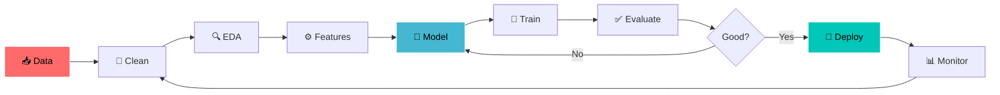

<!--
╔══════════════════════════════════════════════════════════════════════╗
║   TARUN MEHARDA · GitHub Profile README                              ║
║   Accent #00C7B7 · Theme tokyonight · Vibe: neon / futuristic        ║
║   Everything is in this ONE file — snake setup is in the <details>   ║
║   block near the bottom. If an external image ever fails to load,    ║
║   it's just a CDN hiccup — refresh the page.                         ║
╚══════════════════════════════════════════════════════════════════════╝
-->

<!-- ════════════════ ✦ HERO ✦ ════════════════ -->
<a href="#"></a>

<div align="center">

 &nbsp; **Hey, I'm Tarun — I turn messy data into intelligent systems.** &nbsp; 

<br/>


<br/><br/>

<!-- ✦ NEON SOCIAL ROW ✦ -->
<a href="https://tarun-meharda-portfolio.netlify.app/" target="_blank"></a>
<a href="https://www.linkedin.com/in/tarun-meharda-62878a34a/" target="_blank"></a>
<a href="mailto:tarunmehrda@gmail.com"></a>
<a href="https://github.com/tarunmehrda" target="_blank"></a>

<br/>


</div>

<!-- ✦ neon divider ✦ -->


##  &nbsp; `whoami`

<table border="0">
<tr>
<td width="58%" valign="top">

```python
class Tarun:
    def __init__(self):
        self.role      = "AI/ML Engineer & Data Scientist"
        self.base      = "Pilani, Rajasthan 🇮🇳"
        self.degree    = "B.Tech, Computer Science"
        self.coffee    = float("inf")

    def stack(self):
        return {
            "ML"  : ["Deep Learning", "Neural Nets", "AutoML"],
            "NLP" : ["Transformers", "LLMs", "RAG", "Fine-tuning"],
            "CV"  : ["CNNs", "Detection", "Segmentation"],
            "DS"  : ["Stats", "EDA", "Feature Eng", "A/B Tests"],
        }

    def mission(self):
        return "Build AI that solves real problems. 🚀"


print(Tarun().mission())
# >>> Build AI that solves real problems. 🚀
```

</td>
<td width="42%" valign="top">


</td>
</tr>
</table>

<table>
<tr>
<td width="50%" valign="top">

#### 🧪 Currently building
- 🔥 RAG document Q&A system
- 🎨 Stable Diffusion image generation
- 🤖 Multi-agent AI workflows
- ⚙️ Automated end-to-end ML pipeline

</td>
<td width="50%" valign="top">

#### 🌱 Currently learning
- 🧠 LLM fine-tuning (LoRA / QLoRA)
- 🔎 Neural Architecture Search
- 📦 MLOps: Docker + MLflow
- 🛰️ Agentic AI & tool-use

</td>
</tr>
</table>


##  &nbsp; Tech Arsenal

<div align="center">


<br/>


<br/><br/>

**🤖 ML / DL**


**🧬 NLP / GenAI**


**📊 Data Science**


</div>


##  &nbsp; Featured Projects

<table>
<tr>
<td width="50%" valign="top">

### 📈 [Stock & Crypto Price Predictor](https://github.com/tarunmehrda/Real-Time-Stock-Crypto-Minute-Level-Price-Prediction)
> Minute-level forecasting on volatile markets with real-time streaming + retraining.

`LSTM` · `TensorFlow` · `Streamlit`

**🎯 87% accuracy** · live dashboard · auto-retraining

</td>
<td width="50%" valign="top">

### 🤖 [CoderBuddy — AI Coding Assistant](https://github.com/tarunmehrda/CoderBuddy)
> GPT-powered, context-aware code generation with a clean React UI.

`OpenAI` · `FastAPI` · `React`

**⚡ ~40% faster** repetitive work · multi-language

</td>
</tr>
<tr>
<td width="50%" valign="top">

### 🏥 [Healthcare Premium Prediction](https://github.com/tarunmehrda/Healthcare-Premium-Prediction)
> Production-deployed regression with heavy feature engineering.

`Scikit-learn` · `XGBoost` · `Flask`

**🎯 92% accuracy** · full EDA · live API

</td>
<td width="50%" valign="top">

### 🧠 [More dropping soon…](https://github.com/tarunmehrda)
> Always one experiment ahead.

`RAG` · `Diffusion` · `Multi-Agent`

**🔭 In the lab:** doc Q&A · image gen · auto-ML

</td>
</tr>
</table>


##  &nbsp; The Numbers

<div align="center">


<br/>


<br/>


</div>


## 🐍 Watch my commits get eaten — *the unique bit*

<div align="center">

<picture>
  <source media="(prefers-color-scheme: dark)" srcset="https://raw.githubusercontent.com/tarunmehrda/tarunmehrda/output/snake-dark.svg"/>
  <source media="(prefers-color-scheme: light)" srcset="https://raw.githubusercontent.com/tarunmehrda/tarunmehrda/output/snake.svg"/>
  
</picture>

<sub>🟢 A snake slithers across my contribution graph and devours every commit — regenerated automatically every day, with a separate dark-mode skin. Most profiles skip the dark variant.</sub>

</div>

<details>
<summary><b>⚙️ Click to turn the snake ON (one-time, ~2 min)</b></summary>

<br/>

1. Your profile repo must be named exactly **`tarunmehrda/tarunmehrda`** with this `README.md` in its root.
2. Create the file **`.github/workflows/snake.yml`** with the contents below.
3. Repo → **Settings → Actions → General → Workflow permissions** → enable **Read and write** → Save.
4. Go to the **Actions** tab → run **"Generate Snake"** once. Done — it now refreshes daily and the images above go live.

```yaml
# .github/workflows/snake.yml
name: Generate Snake
on:
  schedule:
    - cron: "0 0 * * *"   # daily
  workflow_dispatch:        # manual run button
  push:
    branches: [ main ]
permissions:
  contents: write
jobs:
  generate:
    runs-on: ubuntu-latest
    timeout-minutes: 5
    steps:
      - name: Generate snake SVGs
        uses: Platane/snk@v3
        with:
          github_user_name: ${{ github.repository_owner }}
          outputs: |
            dist/snake.svg
            dist/snake-dark.svg?palette=github-dark&color_snake=#00C7B7
      - name: Push to output branch
        uses: crazy-max/ghaction-github-pages@v4
        with:
          target_branch: output
          build_dir: dist
        env:
          GITHUB_TOKEN: ${{ secrets.GITHUB_TOKEN }}
```

> Until you run step 4 once, the snake images show as broken — that's expected.

</details>


## 🧭 How I Build

<div align="center">



</div>


## 🎒 More about me

<details>
<summary><b>📚 Full toolkit (click to expand)</b></summary>

<br/>

| Domain | Tools |
|:---|:---|
| **Deep Learning** | PyTorch · TensorFlow · Keras · CNNs · RNN/LSTM · GANs · Transfer Learning |
| **NLP / GenAI** | Transformers · BERT · GPT · T5 · LangChain · RAG · spaCy · NLTK |
| **Computer Vision** | OpenCV · Object Detection · Segmentation · Image Classification |
| **Data Science** | Pandas · NumPy · Plotly · Matplotlib · Seaborn · Time Series · A/B Testing |
| **Deploy / MLOps** | FastAPI · Flask · Streamlit · Django · Docker · MLflow · Git |
| **Databases** | MySQL · PostgreSQL · MongoDB · Redis |

</details>

<details>
<summary><b>✍️ Writing & knowledge sharing</b></summary>

<br/>

| Topic | Platform | Status |
|:---|:---:|:---:|
| Deep Dive into Transformer Architecture | Medium | ✅ Published |
| Building Production ML Pipelines | Dev.to | ✅ Published |
| Fine-tuning LLMs: A Practical Guide | Medium | ✍️ In Progress |
| MLOps Best Practices | Dev.to | ✍️ In Progress |

</details>

<details>
<summary><b>🥚 Easter egg</b></summary>

<br/>

```bash
$ sudo apt install motivation
Reading package lists... Done
Setting up motivation (∞) ...
✔ "Data is the new oil — I'm here to refine it into intelligence."
```

</details>


## 💬 Dev quote of the day

<div align="center">

</div>


## 🤝 Let's build something

<div align="center">

Open to **AI/ML research** · **data science consulting** · **AI product builds** · **technical writing**.

<a href="https://tarun-meharda-portfolio.netlify.app/" target="_blank"></a>
<a href="https://www.linkedin.com/in/tarun-meharda-62878a34a/" target="_blank"></a>
<a href="mailto:tarunmehrda@gmail.com"></a>

</div>


