<!--
╔══════════════════════════════════════════════════════════════════════╗
║   TARUN KUMAR MEHARDA · GitHub Profile README  (v2 — reliable img)   ║
║   Palette: violet #7C3AED → cyan #06B6D4 · Theme: radical            ║
║                                                                      ║
║   IMAGE NOTES (read me):                                             ║
║   • Only stable image services are used (shields, skillicons,        ║
║     capsule-render, github-readme-stats, streak-stats.demolab.com).  ║
║   • The 3D isocalendar + snake stay BROKEN until you run their       ║
║     GitHub Actions ONCE — see the <details> block lower down.        ║
║   • If a stats card is ever blank, it's a temporary rate-limit on    ║
║     the public API — just refresh.                                   ║
╚══════════════════════════════════════════════════════════════════════╝
-->

<!-- ══════════ HERO ══════════ -->


<div align="center">

<a href="https://readme-typing-svg.demolab.com">

</a>

<br/>

<!-- Social badges -->
<a href="https://tarun-meharda.netlify.app/"></a>
<a href="https://www.linkedin.com/in/tarun-meharda-62878a34a/"></a>
<a href="https://github.com/tarunmehrda"></a>
<a href="https://leetcode.com/tarunmehrda"></a>
<a href="mailto:tarunmehrda@gmail.com"></a>

<br/><br/>


</div>

---

## 👋 About Me

```yaml
name:      Tarun Kumar Meharda
role:      AI/ML Engineer · Data Scientist · Flutter Developer
based_in:  Chandigarh, India 🇮🇳
education: B.E. Electronics & Communication — UIET, Panjab University ('27)
focus:     [ Deep Learning, NLP, Computer Vision, GenAI/RAG, App Dev ]
mission:   "Build AI that solves real problems — and ship it as a real product."
fun_fact:  400+ DSA problems solved · Top 5% of batch · Founder x2
```

- 🔭 Currently building an **AI healthcare app** (Flutter + Supabase) and **RAG / multi-agent** systems
- 🌱 Learning **LLM fine-tuning (LoRA/QLoRA)**, **MLOps** (Docker · MLflow · CI/CD) and **cloud ML**
- 🚀 Founder of **AppVerse Future** & **TargetHire AI** · Top performer at **Smart India & FOSS Hackathons**
- 💬 Ask me about **AI/ML, RAG, Computer Vision, or shipping Flutter apps**

---

## 🛠️ Tech Stack

<div align="center">

**Languages & Core**
<br/>


**AI / ML / Data**
<br/>

&nbsp;


**GenAI / NLP**
<br/>


**App · Backend · DevOps**
<br/>


</div>

---

## 🚀 Featured Projects

<div align="center">

| Project | Stack | Highlight |
|:--|:--|:--|
| 📈 **[Stock & Crypto Predictor](https://github.com/tarunmehrda/Real-Time-Stock-Crypto-Minute-Level-Price-Prediction)** | LSTM-Transformer · TensorFlow · Streamlit | **89.3% acc · R² 0.94**, real-time + auto-retrain |
| 🤖 **[CoderBuddy — AI Code Assistant](https://github.com/tarunmehrda/CoderBuddy)** | OpenAI · LangChain · FAISS · FastAPI | RAG-based generate / explain / debug, chat memory |
| 🛡️ **[Crypto-Mining Malware Detector](https://github.com/tarunmehrda)** | scikit-learn · Random Forest · NN | **94% accuracy** on CPU/network telemetry |
| 🏥 **[Healthcare Premium Prediction](https://github.com/tarunmehrda/Healthcare-Premium-Prediction)** | scikit-learn · XGBoost · Flask | **92% accuracy**, full EDA, live API |

</div>

<div align="center">
<a href="https://github.com/tarunmehrda?tab=repositories"></a>
</div>

---

## 🗂️ Pinned Project Cards

<div align="center">

<a href="https://github.com/tarunmehrda/Real-Time-Stock-Crypto-Minute-Level-Price-Prediction"></a>
<a href="https://github.com/tarunmehrda/CoderBuddy"></a>
<a href="https://github.com/tarunmehrda/Healthcare-Premium-Prediction"></a>

</div>

> 🖼️ Instant image cards — no setup needed. Swap the `repo=` names to feature different projects.

---

## 📊 GitHub Stats

<div align="center">


<br/>


<br/>


<br/>


</div>

---

## 🃏 Profile Summary Cards

<div align="center">

<!-- Auto-generated by github-profile-summary-cards (theme 2077). Run its workflow once. -->


</div>

---

## ⚡ Recent Activity

<!-- This list auto-updates from your latest GitHub events (github-activity-readme). -->
<!--START_SECTION:activity-->
<!--END_SECTION:activity-->

---

## 🧊 3D Contribution Calendar &nbsp;·&nbsp; *isocalendar (lowlighter/metrics)*

<div align="center">

<!-- Standalone 3D isometric calendar (full year) — lowlighter/metrics isocalendar plugin. -->
<!-- Path must EXACTLY match the workflow's `filename:` option (./ relative, no leading slash). -->


<sub>🧊 A 3D isometric calendar of my last year of contributions — auto-rebuilt daily by the lowlighter/metrics isocalendar plugin.</sub>

<br/><br/>

<!-- Second infographic: languages, habits, activity, achievements, topics, code & more. -->


<sub>📊 Languages (in-depth), coding habits, activity timeline, achievements, follow-ups, topics, a code snippet & more — auto-built daily by lowlighter/metrics.</sub>

</div>

---

## 🐍 Contribution Snake

<div align="center">

<picture>
  <source media="(prefers-color-scheme: dark)" srcset="https://raw.githubusercontent.com/tarunmehrda/tarunmehrda/output/snake-dark.svg"/>
  <source media="(prefers-color-scheme: light)" srcset="https://raw.githubusercontent.com/tarunmehrda/tarunmehrda/output/snake.svg"/>
  
</picture>

<sub>🟢 A snake slithers across my contribution graph and eats every commit — regenerated automatically every day.</sub>

</div>

---

## 🌆 3D Contribution Skyline

<div align="center">

<!-- Animated isometric 3D skyline of commits — profile-3d-contrib (needs only the built-in token). -->


<sub>🏙️ Every commit rises as a tower in an animated isometric 3D city — a different 3D view from the calendar above. Auto-rebuilt daily.</sub>

</div>

<details>
<summary><b>⚙️ All three stay BROKEN until you run their Actions once — click for the 5-min setup</b></summary>

<br/>

### 🔑 Step 0 — Create the token Metrics needs (one time)
1. GitHub → **Settings → Developer settings → Personal access tokens → Tokens (classic) → Generate new token (classic)**.
2. Name it `metrics`, tick the **`public_repo`** scope (enough for a public profile), generate, and **copy** it.
3. In your profile repo → **Settings → Secrets and variables → Actions → New repository secret** → Name: **`METRICS_TOKEN`**, Value: paste the token → **Add secret**.
4. Also enable **Settings → Actions → General → Workflow permissions → Read and write permissions → Save**.

> Your repo must be named exactly **`tarunmehrda/tarunmehrda`** with this `README.md` in its root.

### 🧊 Step 1 — `.github/workflows/metrics.yml`  (3D isocalendar + BIG infographic)

```yaml
name: Metrics
on:
  schedule: [{ cron: "0 0 * * *" }]          # daily
  workflow_dispatch:                          # manual run button
  push: { branches: [ "main", "master" ] }
jobs:
  github-metrics:
    runs-on: ubuntu-latest
    permissions:
      contents: write                         # REQUIRED so the SVGs get committed
    steps:
      # ── 1) Standalone 3D isometric calendar (full year) ─────────────
      - uses: lowlighter/metrics@latest
        with:
          token: ${{ secrets.METRICS_TOKEN }} # the PAT you saved in Step 0
          user: tarunmehrda
          filename: github-metrics-isocalendar.svg   # MUST match the  in the README
          base: ""                            # render ONLY the calendar (no header panel)
          plugin_isocalendar: yes             # 🧊 the 3D isometric calendar
          plugin_isocalendar_duration: full-year   # last 365 days

      # ── 2) BIG all-in-one infographic ───────────────────────────────
      - uses: lowlighter/metrics@latest
        with:
          token: ${{ secrets.METRICS_TOKEN }}
          user: tarunmehrda
          filename: github-metrics.svg        # MUST match the 2nd  in the README
          template: classic
          base: header, activity, community, repositories, metadata
          config_timezone: Asia/Kolkata
          config_animations: yes
          plugins_errors_fatal: no            # if a plugin fails, skip it (don't fail the run)

          # 🗣️ Languages (detailed + in-depth)
          plugin_languages: yes
          plugin_languages_ignored: html, css, tex, makefile, jupyter-notebook
          plugin_languages_details: bytes-size, percentage
          plugin_languages_sections: most-used, recently-used
          plugin_languages_limit: 10
          plugin_languages_indepth: yes
          plugin_languages_analysis_timeout: 15
          plugin_languages_colors: github

          # ⏰ Coding habits
          plugin_habits: yes
          plugin_habits_from: 200
          plugin_habits_days: 14
          plugin_habits_facts: yes
          plugin_habits_charts: yes
          plugin_habits_trim: yes

          # 📰 Recent activity timeline
          plugin_activity: yes
          plugin_activity_limit: 7
          plugin_activity_days: 14
          plugin_activity_visibility: all
          plugin_activity_timestamps: yes

          # 🌟 Notable contributions
          plugin_notable: yes
          plugin_notable_repositories: yes

          # 🏆 Achievements (detailed)
          plugin_achievements: yes
          plugin_achievements_threshold: C
          plugin_achievements_secrets: yes
          plugin_achievements_display: detailed
          plugin_achievements_limit: 0

          # 🔁 Follow-up (issues / PRs)
          plugin_followup: yes
          plugin_followup_sections: repositories, user

          # 👥 People (followers / following)
          plugin_people: yes
          plugin_people_limit: 24
          plugin_people_types: followers, following

          # 📏 Lines of code changed
          plugin_lines: yes
          plugin_lines_sections: base
          plugin_lines_repositories_limit: 4

          # 📌 Repositories
          plugin_repositories: yes
          plugin_repositories_pinned: 2
          plugin_repositories_order: featured, pinned, starred, random

          # 🏷️ Topics / technologies used
          plugin_topics: yes
          plugin_topics_mode: labels
          plugin_topics_sort: stars
          plugin_topics_limit: 12

          # 💻 A random snippet of code you wrote
          plugin_code: yes
          plugin_code_lines: 12

          # ⭐ Star history chart
          plugin_stargazers: yes
          plugin_stargazers_charts: yes

          # 🌠 Recently starred repos
          plugin_stars: yes
          plugin_stars_limit: 2
```

> The two steps create **two files** (`github-metrics-isocalendar.svg` and `github-metrics.svg`) — both referenced in the README above. `plugins_errors_fatal: no` keeps the run green even if a plugin has no data yet. Want a smaller image? Remove any `plugin_*` blocks you don't want.

### 🐍 Step 2 — `.github/workflows/snake.yml`

```yaml
name: Generate Snake
on:
  schedule: [{ cron: "0 0 * * *" }]
  workflow_dispatch:
  push: { branches: [ main ] }
permissions:
  contents: write
jobs:
  generate:
    runs-on: ubuntu-latest
    steps:
      - uses: Platane/snk@v3
        with:
          github_user_name: ${{ github.repository_owner }}
          outputs: |
            dist/snake.svg
            dist/snake-dark.svg?palette=github-dark&color_snake=#7C3AED
      - uses: crazy-max/ghaction-github-pages@v4
        with:
          target_branch: output
          build_dir: dist
        env:
          GITHUB_TOKEN: ${{ secrets.GITHUB_TOKEN }}
```

### 🌆 Step 2b — `.github/workflows/3d-skyline.yml`  (no extra token needed)

```yaml
name: 3D Skyline
on:
  schedule: [{ cron: "30 0 * * *" }]
  workflow_dispatch:
  push: { branches: [ "main", "master" ] }
permissions:
  contents: write
jobs:
  build:
    runs-on: ubuntu-latest
    steps:
      - uses: actions/checkout@v4
      - uses: yoshi389111/github-profile-3d-contrib@0.7.1
        env:
          GITHUB_TOKEN: ${{ secrets.GITHUB_TOKEN }}   # built-in token — no PAT needed
          USERNAME: ${{ github.repository_owner }}
      - run: |
          git config --global user.name 'github-actions[bot]'
          git config --global user.email 'github-actions[bot]@users.noreply.github.com'
          git add -A .
          git commit -m "regenerate 3D skyline" || echo "no changes"
          git push
```

> This one uses only `${{ secrets.GITHUB_TOKEN }}` (built-in) — **no METRICS_TOKEN required.** It outputs to the `profile-3d-contrib/` folder referenced above.

### ▶️ Step 3 — Run them once
Open the **Actions** tab → run **"Metrics"**, **"Generate Snake"**, and **"3D Skyline"** with the *Run workflow* button. After ~1–2 min, all images above go live and refresh daily.

### 🩺 Still showing a broken image? Check these (in order)
1. **Did the run go green?** Actions tab → open the **Metrics** run. A red ❌ tells you the cause:
   - `Bad credentials` / `Insufficient token scopes` → fix the **`METRICS_TOKEN`** secret (Step 0).
   - `403` on the commit step → **Workflow permissions** aren't "Read and write" (Step 0.4).
2. **Were the files committed?** Browse your repo's file list — there must be **`github-metrics-isocalendar.svg`** and **`github-metrics.svg`** in the root. No files = the run didn't commit (fix #1).
3. **Filename match:** the README `` must match the workflow `filename:` **exactly** (same spelling/casing).
4. **Right branch:** the SVG must be on your **default branch** (`main` *or* `master` — whichever serves your profile).
5. **Looks stale after a fix?** That's GitHub's image cache (Camo). Hard-refresh (Ctrl+F5) or open in an incognito window.

</details>

---

## 🏆 Highlights

<div align="center">


</div>

---

## 📝 Latest Blog Posts

<!-- Auto-pulled from your blog/RSS feed (blog-post-workflow). Set your feed in the workflow. -->
<!-- BLOG-POST-LIST:START -->
<!-- BLOG-POST-LIST:END -->

---

## ⏱️ Weekly Coding Stats &nbsp;·&nbsp; *WakaTime*

<!-- Auto-updates from WakaTime (waka-readme-stats). Needs a free WakaTime account + API key. -->
<!--START_SECTION:waka-->
<!--END_SECTION:waka-->

---

## 🤝 Let's Connect

<div align="center">

Open to **AI/ML · Data Science · GenAI · Flutter** roles — **onsite / hybrid in India**.

<a href="https://tarun-meharda.netlify.app/"></a>
<a href="https://www.linkedin.com/in/tarun-meharda-62878a34a/"></a>
<a href="mailto:tarunmehrda@gmail.com"></a>

</div>


