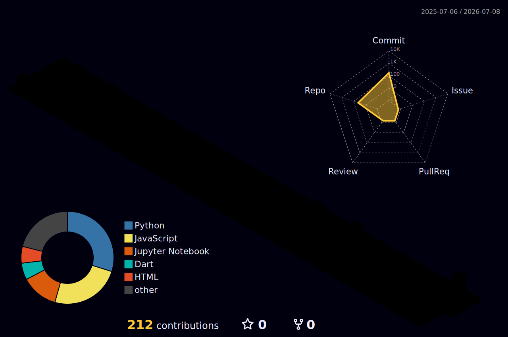
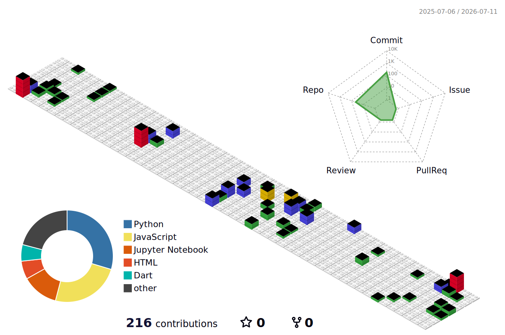
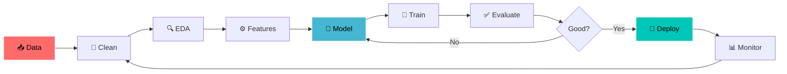

<!--
╔══════════════════════════════════════════════════════════════════════╗
║   TARUN MEHARDA · GitHub Profile README                              ║
║   Accent #00C7B7 · Theme tokyonight · Vibe: neon / futuristic        ║
║   3D contribution city + snake are set up in the <details> block     ║
║   near the bottom. If an external image fails to load, it's usually  ║
║   a CDN hiccup — refresh the page.                                    ║
╚══════════════════════════════════════════════════════════════════════╝
-->

<!-- ════════════════ ✦ HERO ✦ ════════════════ -->
<a href="#"></a>

<div align="center">

 &nbsp; **Hey, I'm Tarun — I turn messy data into intelligent systems & ship them as real apps.** &nbsp; 

<br/>


<br/><br/>

<!-- ✦ NEON SOCIAL ROW ✦ -->
<a href="https://tarun-meharda.netlify.app/" target="_blank"></a>
<a href="https://www.linkedin.com/in/tarun-meharda-62878a34a/" target="_blank"></a>
<a href="https://leetcode.com/tarunmehrda" target="_blank"></a>
<a href="mailto:tarunmehrda@gmail.com"></a>
<a href="https://github.com/tarunmehrda" target="_blank"></a>

<br/>


</div>

<!-- ✦ neon divider ✦ -->


##  &nbsp; `whoami`

<table border="0">
<tr>
<td width="58%" valign="top">

```python
class Tarun:
    def __init__(self):
        self.role      = "AI/ML Engineer · Data Scientist · Flutter Dev"
        self.base      = "Chandigarh, India 🇮🇳"
        self.degree    = "B.E. Electronics & Communication (UIET, PU)"
        self.coffee    = float("inf")

    def stack(self):
        return {
            "ML"  : ["Deep Learning", "Neural Nets", "Model Deploy"],
            "NLP" : ["Transformers", "LLMs", "RAG", "Conversational AI"],
            "CV"  : ["CNNs", "OpenCV", "Detection", "Edge AI"],
            "APP" : ["Flutter", "Dart", "Supabase", "Firebase"],
        }

    def mission(self):
        return "Build AI that solves real problems — and ship it. 🚀"


print(Tarun().mission())
# >>> Build AI that solves real problems — and ship it. 🚀
```

</td>
<td width="42%" valign="top">


</td>
</tr>
</table>

<table>
<tr>
<td width="50%" valign="top">

#### 🧪 Currently building
- 🏥 AI healthcare app @ ZenUp Health (Flutter + Supabase)
- 🔥 RAG document Q&A system
- 🤖 Multi-agent AI workflows
- ⚙️ Automated end-to-end ML pipelines

</td>
<td width="50%" valign="top">

#### 🌱 Currently learning
- 🧠 LLM fine-tuning (LoRA / QLoRA)
- 📦 MLOps: Docker + MLflow + CI/CD
- 🛰️ Agentic AI & tool-use
- ☁️ Cloud ML (AWS / GCP / Vertex AI)

</td>
</tr>
</table>


##  &nbsp; Tech Arsenal

<div align="center">


<br/>


<br/><br/>

**🤖 ML / DL**


**🧬 NLP / GenAI**


**📱 App / Backend**


**📊 Data Science**


</div>


##  &nbsp; Featured Projects

<table>
<tr>
<td width="50%" valign="top">

### 📈 [Stock & Crypto Price Predictor](https://github.com/tarunmehrda/Real-Time-Stock-Crypto-Minute-Level-Price-Prediction)
> Minute-level forecasting on volatile markets with real-time streaming + retraining.

`LSTM-Transformer` · `TensorFlow` · `Streamlit`

**🎯 89.3% accuracy · R² 0.94** · live dashboard · auto-retraining

</td>
<td width="50%" valign="top">

### 🤖 [CoderBuddy — AI Coding Assistant](https://github.com/tarunmehrda/CoderBuddy)
> LLM-powered, context-aware code generation using a RAG pipeline + vector DBs.

`OpenAI` · `LangChain` · `FAISS` · `FastAPI`

**⚡ generate · explain · debug** · multi-turn chat memory

</td>
</tr>
<tr>
<td width="50%" valign="top">

### 🛡️ [Crypto-Mining Malware Detector](https://github.com/tarunmehrda)
> Detects cryptojacking from CPU / network / I/O telemetry using supervised ML.

`scikit-learn` · `Random Forest` · `Neural Nets`

**🎯 94% accuracy** · feature engineering · cross-validation

</td>
<td width="50%" valign="top">

### 🏥 [Healthcare Premium Prediction](https://github.com/tarunmehrda/Healthcare-Premium-Prediction)
> Production-deployed regression with heavy feature engineering.

`Scikit-learn` · `XGBoost` · `Flask`

**🎯 92% accuracy** · full EDA · live API

</td>
</tr>
</table>

<div align="center">
<a href="https://github.com/tarunmehrda?tab=repositories"></a>
</div>


## 🏆 Highlights

<div align="center">


</div>


##  &nbsp; The Numbers

<div align="center">


<br/>


</div>


## 🧊 3D Contribution City — *the part nobody else has*

<div align="center">

<!-- 🟢 Animated isometric 3D skyline of every contribution. Auto-generated daily. -->


<br/>

<!-- 🧱 'gitblock' skin: my commits rendered as a stacked 3D block tower. -->


<sub>🏙️ Every commit I make rises as a tower in an animated isometric 3D city — rebuilt automatically every day. Setup is in the toggle below.</sub>

</div>


## 🐍 Watch my commits get eaten

<div align="center">

<picture>
  <source media="(prefers-color-scheme: dark)" srcset="https://raw.githubusercontent.com/tarunmehrda/tarunmehrda/output/snake-dark.svg"/>
  <source media="(prefers-color-scheme: light)" srcset="https://raw.githubusercontent.com/tarunmehrda/tarunmehrda/output/snake.svg"/>
  
</picture>

<sub>🟢 A snake slithers across my contribution graph and devours every commit — regenerated automatically every day, with a separate dark-mode skin.</sub>

</div>

<details>
<summary><b>⚙️ Click to turn the 3D city + snake ON (one-time, ~3 min)</b></summary>

<br/>

**Step 1 — Repo setup**
1. Your profile repo must be named exactly **`tarunmehrda/tarunmehrda`** with this `README.md` in its root.
2. Repo → **Settings → Actions → General → Workflow permissions** → enable **Read and write permissions** → Save.

**Step 2 — Add the 3D city workflow** at `.github/workflows/3d-contrib.yml`:

```yaml
# .github/workflows/3d-contrib.yml
name: 3D Contribution City
on:
  schedule:
    - cron: "30 0 * * *"   # daily
  workflow_dispatch:        # manual run button
permissions:
  contents: write
jobs:
  build:
    runs-on: ubuntu-latest
    steps:
      - uses: actions/checkout@v4
      - uses: yoshi389111/github-profile-3d-contrib@0.7.1
        env:
          GITHUB_TOKEN: ${{ secrets.GITHUB_TOKEN }}
          USERNAME: ${{ github.repository_owner }}
      - name: Commit & push
        run: |
          git config --global user.name 'github-actions[bot]'
          git config --global user.email 'github-actions[bot]@users.noreply.github.com'
          git add -A .
          git commit -m "chore: regenerate 3D contribution city" || echo "no changes"
          git push
```

**Step 3 — Add the snake workflow** at `.github/workflows/snake.yml`:

```yaml
# .github/workflows/snake.yml
name: Generate Snake
on:
  schedule:
    - cron: "0 0 * * *"   # daily
  workflow_dispatch:
  push:
    branches: [ main ]
permissions:
  contents: write
jobs:
  generate:
    runs-on: ubuntu-latest
    timeout-minutes: 5
    steps:
      - name: Generate snake SVGs
        uses: Platane/snk@v3
        with:
          github_user_name: ${{ github.repository_owner }}
          outputs: |
            dist/snake.svg
            dist/snake-dark.svg?palette=github-dark&color_snake=#00C7B7
      - name: Push to output branch
        uses: crazy-max/ghaction-github-pages@v4
        with:
          target_branch: output
          build_dir: dist
        env:
          GITHUB_TOKEN: ${{ secrets.GITHUB_TOKEN }}
```

**Step 4 — Run them once**
- Go to the **Actions** tab → run **"3D Contribution City"** and **"Generate Snake"** once each (the ▶ *Run workflow* button).
- Both now refresh daily, and the 3D city + snake images above go live.

> Until you run Step 4 once, the 3D city and snake images show as broken — that's expected.

</details>


## 🧭 How I Build

<div align="center">



</div>


## 🎒 More about me

<details>
<summary><b>📚 Full toolkit (click to expand)</b></summary>

<br/>

| Domain | Tools |
|:---|:---|
| **Deep Learning** | PyTorch · TensorFlow · Keras · CNNs · RNN/LSTM · Transfer Learning |
| **NLP / GenAI** | Transformers · LLMs · LangChain · RAG · Prompt Engineering · Conversational AI |
| **Computer Vision** | OpenCV · CNNs · Image Classification · Detection · Edge AI |
| **Data Science** | Pandas · NumPy · Matplotlib · Seaborn · EDA · Regression · Clustering |
| **App / Mobile** | Flutter · Dart · Cross-platform (Android/iOS) · MVVM · Responsive UI |
| **Deploy / MLOps** | FastAPI · Flask · Streamlit · Docker · MLflow · CI/CD · Git |
| **Databases** | MySQL · PostgreSQL · Supabase · Firebase · MongoDB · FAISS · Pinecone |
| **Cloud** | AWS · Azure · GCP · SageMaker · Vertex AI |

</details>

<details>
<summary><b>🥚 Easter egg</b></summary>

<br/>

```bash
$ sudo apt install motivation
Reading package lists... Done
Setting up motivation (∞) ...
✔ "Data is the new oil — I'm here to refine it into intelligence."
```

</details>


## 💬 Dev quote of the day

<div align="center">

</div>


## 🤝 Let's build something

<div align="center">

Open to **AI/ML roles** · **data science** · **AI product builds** · **Flutter app development** — onsite / hybrid in India.

<a href="https://tarun-meharda.netlify.app/" target="_blank"></a>
<a href="https://www.linkedin.com/in/tarun-meharda-62878a34a/" target="_blank"></a>
<a href="mailto:tarunmehrda@gmail.com"></a>

</div>


