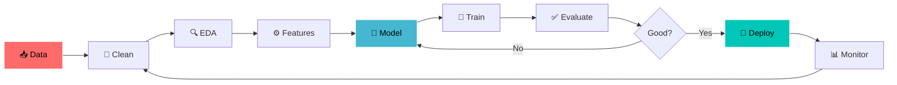

<!--
═══════════════════════════════════════════════════════════════
  TARUN MEHARDA · GitHub Profile README
  Accent color: #00C7B7  ·  Theme: tokyonight  ·  Vibe: clean-futuristic
  ⚡ Headline feature: live contribution-snake (setup steps at bottom)
═══════════════════════════════════════════════════════════════
-->

<!-- ░░░ HERO ░░░ -->

  

 

---

## ⚡ `whoami`

# .github/workflows/snake.yml
# Generates the contribution-snake animation used in the profile README.
# Runs every day + on every push to main, and can be triggered manually.

name: Generate Snake

on:
  schedule:
    - cron: "0 0 * * *"   # daily at 00:00 UTC
  workflow_dispatch:        # lets you run it manually from the Actions tab
  push:
    branches:
      - main

permissions:
  contents: write

jobs:
  generate:
    runs-on: ubuntu-latest
    timeout-minutes: 5
    steps:
      - name: Generate snake SVGs
        uses: Platane/snk@v3
        with:
          github_user_name: ${{ github.repository_owner }}
          outputs: |
            dist/snake.svg
            dist/snake-dark.svg?palette=github-dark&color_snake=#00C7B7

      - name: Push to output branch
        uses: crazy-max/ghaction-github-pages@v4
        with:
          target_branch: output
          build_dir: dist
        env:
          GITHUB_TOKEN: ${{ secrets.GITHUB_TOKEN }}

<table>
<tr>
<td width="50%" valign="top">

#### 🧪 Currently building
- 🔥 RAG-based document Q&A system
- 🎨 Image generation with Stable Diffusion
- 🤖 Multi-agent AI workflows
- ⚙️ Automated end-to-end ML pipeline

</td>
<td width="50%" valign="top">

#### 🌱 Currently learning
- 🧠 LLM fine-tuning at scale (LoRA / QLoRA)
- 🔎 Neural Architecture Search
- 📦 MLOps with Docker + MLflow
- 🛰️ Agentic AI & tool-use patterns

</td>
</tr>
</table>

---

## 🛠️ Tech Arsenal

**🤖 ML / Deep Learning**

**🧬 NLP / GenAI**

**📊 Data Science**

**💻 Languages & Deploy**

---

## 🚀 Featured Projects

<table>
<tr>
<td width="50%" valign="top">

### 📈 [Stock & Crypto Price Predictor](https://github.com/tarunmehrda/Real-Time-Stock-Crypto-Minute-Level-Price-Prediction)
> Minute-level forecasting on volatile markets with a real-time streaming + retraining pipeline.

`LSTM` · `TensorFlow` · `Streamlit`

**🎯 87% accuracy** on live crypto data · interactive dashboard · continuous retraining

</td>
<td width="50%" valign="top">

### 🤖 [CoderBuddy — AI Coding Assistant](https://github.com/tarunmehrda/CoderBuddy)
> GPT-powered, context-aware code generation with a clean React front end.

`OpenAI` · `FastAPI` · `React`

**⚡ ~40% faster** on repetitive tasks · multi-language · real-time analysis

</td>
</tr>
<tr>
<td width="50%" valign="top">

### 🏥 [Healthcare Premium Prediction](https://github.com/tarunmehrda/Healthcare-Premium-Prediction)
> Production-deployed regression system with heavy feature engineering and validation.

`Scikit-learn` · `XGBoost` · `Flask`

**🎯 92% accuracy** · full EDA · ensemble methods · live API

</td>
<td width="50%" valign="top">

### 🧠 [More dropping soon…](https://github.com/tarunmehrda)
> Always one experiment ahead.

`RAG` · `Stable Diffusion` · `Multi-Agent`

**🔭 In the lab:** doc Q&A · image gen · automated ML framework

</td>
</tr>
</table>

---

## 📊 The Numbers

 

---

## 🐍 Watch my commits get eaten

<!-- ░░░ HEADLINE UNIQUE FEATURE — contribution snake (auto-generated by GitHub Action) ░░░ -->

<picture>
  <source media="(prefers-color-scheme: dark)" srcset="https://raw.githubusercontent.com/tarunmehrda/tarunmehrda/output/snake-dark.svg"/>
  <source media="(prefers-color-scheme: light)" srcset="https://raw.githubusercontent.com/tarunmehrda/tarunmehrda/output/snake.svg"/>
  
</picture>

🟢 The snake slithers across my contribution graph and devours each commit — regenerated automatically every day. <em>(Setup steps are at the bottom of this file.)</em>

---

## 🧭 How I Build

---

## ✍️ Writing & Sharing

| 📝 Topic | 🔗 Platform | 📅 Status |
|:---|:---:|:---:|
| Deep Dive into Transformer Architecture | Medium | ✅ Published |
| Building Production ML Pipelines | Dev.to | ✅ Published |
| Fine-tuning LLMs: A Practical Guide | Medium | ✍️ In Progress |
| MLOps Best Practices | Dev.to | ✍️ In Progress |

---

## 💬 Dev quote of the day

---

## 🤝 Let's build something

I'm open to **AI/ML research**, **data science consulting**, **AI product builds**, and **technical writing**.

  

<strong>⚡ "Data is the new oil — I'm here to refine it into intelligence."</strong>

Built with 🧠 AI · ❤️ passion · ☕ coffee

<!--
═══════════════════════════════════════════════════════════════
  🐍 SNAKE ANIMATION — ONE-TIME SETUP (delete this comment after)
  1. This file must live in a repo named exactly: tarunmehrda/tarunmehrda
  2. Create file:  .github/workflows/snake.yml   (contents provided alongside this README)
  3. GitHub → repo Settings → Actions → General → Workflow permissions
     → enable "Read and write permissions" → Save
  4. Run it once:  Actions tab → "Generate Snake" → Run workflow
  5. Done — it now refreshes daily and the images above go live.
═══════════════════════════════════════════════════════════════
-->
