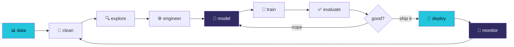

<div align="center">


<a href="https://tarun-meharda-portfolio.netlify.app/"></a>
<a href="https://www.linkedin.com/in/tarun-meharda-62878a34a/"></a>
<a href="mailto:tarunmehrda@gmail.com"></a>
<a href="https://github.com/tarunmehrda"></a>

<br/><br/>


</div>

<br/>

```ansi
[36m╭─────────────────────────────────────────────────────────────╮[0m
[36m│[0m  [35m>[0m  [37mname[0m       Tarun Meharda                                  [36m│[0m
[36m│[0m  [35m>[0m  [37mrole[0m       AI/ML Engineer · Data Scientist                [36m│[0m
[36m│[0m  [35m>[0m  [37mbase[0m       Pilani, Rajasthan, IN                          [36m│[0m
[36m│[0m  [35m>[0m  [37mfocus[0m      LLMs · RAG · Computer Vision · MLOps            [36m│[0m
[36m│[0m  [35m>[0m  [37mstatus[0m     open to collab & opportunities                 [36m│[0m
[36m╰─────────────────────────────────────────────────────────────╯[0m
```

<br/>

<div align="center">

## ⟨ what i actually do ⟩

</div>

> 🧠 **Machine Learning** — end-to-end pipelines from raw data to deployed models  
> 🔮 **NLP & GenAI** — transformers, fine-tuning LLMs, RAG systems, smart chatbots  
> 👁️ **Computer Vision** — detection, segmentation, image & video understanding  
> ⚙️ **MLOps** — production-grade deploys with FastAPI, Docker & cloud infra  
> 📊 **Data Science** — turning messy datasets into decisions people trust

<br/>

<div align="center">

## ⟨ my stack ⟩


</div>

<br/>

<div align="center">

## ⟨ featured drops 🚀 ⟩

</div>

<table width="100%">
<tr>
<td width="50%" valign="top">

#### 📈 [Stock & Crypto Price Predictor](https://github.com/tarunmehrda/Real-Time-Stock-Crypto-Minute-Level-Price-Prediction)
`TensorFlow` · `LSTM` · `Streamlit`

Real-time, minute-level price forecasting with a continuous retraining pipeline and a live dashboard.

**`87%` accuracy on volatile crypto markets**

</td>
<td width="50%" valign="top">

#### 🤖 [CoderBuddy — AI Coding Assistant](https://github.com/tarunmehrda/CoderBuddy)
`OpenAI` · `FastAPI` · `React`

GPT-powered, context-aware code generation with multi-language support and a clean modern UI.

**`-40%` dev time on repetitive tasks**

</td>
</tr>
<tr>
<td width="50%" valign="top">

#### 🏥 [Healthcare Premium Prediction](https://github.com/tarunmehrda/Healthcare-Premium-Prediction)
`scikit-learn` · `XGBoost` · `Flask`

Ensemble learning + heavy feature engineering, shipped as a production-ready Flask API.

**`92%` accuracy · live in production**

</td>
<td width="50%" valign="top">

#### 🔮 cooking right now...
`RAG` · `Diffusion` · `Agents`

→ RAG document Q&A system  
→ Stable Diffusion image gen  
→ Multi-agent AI framework

**stay tuned 👀**

</td>
</tr>
</table>

<br/>

<div align="center">

## ⟨ the numbers ⟩


</div>

<br/>

<div align="center">

## ⟨ how i build ⟩



</div>

<br/>

<div align="center">

## ⟨ let's build something ⟩

**open for** → AI/ML research · data science consulting · AI product dev · technical writing

<a href="https://tarun-meharda-portfolio.netlify.app/"></a>
<a href="https://www.linkedin.com/in/tarun-meharda-62878a34a/"></a>

<br/><br/>


<br/><br/>

> *"data is the new oil — i'm just here to refine it into intelligence."* ⚡


</div>
